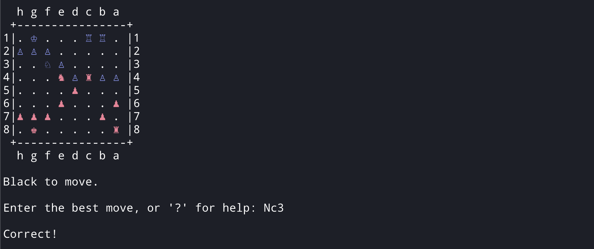

# Chess Trainer CLI ♟️

A chess daily puzzle and tactics trainer for the command line

## Built With
- Go
- [The Lichess Puzzles API](https://lichess.org/api#tag/Puzzles)
- [Chess](https://github.com/notnil/chess)

## Why?

Completing puzzles on Chess.com or Lichess is fun, but I often find myself drawing arrows out of habit instead of trying to visualize the moves in my head. Also, it's pretty convenient to quickly complete a puzzle in the terminal whenever I'm waiting for code to compile. I'm planning to develop this into a full training CLI to supplement my training on more traditional chess websites.

## Quick Start

### Installation

1. Clone the repository:

   ```sh
   git clone https://github.com/kjalba/chess-trainer-cli.git
   ```

2. Change to the project directory:

   ```sh
   cd chess-trainer-cli
   ```

3. Install dependencies:

   Run the following command to download all required dependencies from your `go.mod` and `go.sum` files.

   ```sh
   go mod tidy
   ```

4. Run the program:

   ```sh
   go run main.go
   ```

Now you're ready to solve some chess puzzles!

## Usage

After running the program, it automatically fetches the daily chess puzzle from Lichess, draws the board in your terminal, and prompts you to enter your move.

### Command-line Interaction

- **Make a move**: Type your move in SAN notation (e.g., `e4`, `Nf3`) or UCI notation (e.g., `e2e4`) when prompted.
- **View correct move**: If you’re stuck, press `Enter` to reveal the correct move and continue with the puzzle.
- **Help**: Type `?` or `help` to display a list of available commands.
- **User feedback**: Correct moves are acknowledged, while incorrect ones will ask you to try again.

### Example



## Roadmap

The following features are planned for future versions:

- [x] Show the opponent's and user's moves in algebraic notation instead of UCI.
- [ ] Add optional tags in the menu for different types of problem-solving.
- [ ] Implement a random puzzle generator with customizable parameters such as theme and difficulty.
- [ ] Improve UI readability by adding colors and better formatting.
- [ ] Add an option to draw the board with one of the tags in the menu.

## Contributing

Contributions are welcome! To contribute:

1. Fork the repository.
2. Create your feature branch (`git checkout -b feature/my-feature`).
3. Commit your changes (`git commit -m 'Add some feature'`).
4. Push to the branch (`git push origin feature/my-feature`).
5. Open a pull request.

Feel free to open an issue if you want to discuss improvements or features before working on them.